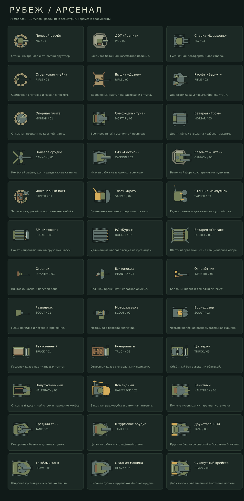

# Рубеж

## Новая версия: C# / Godot

Ветка `rewrite/godot-csharp` содержит новую самостоятельную 2D-игру в
`native/Game/project.godot`. Код игрового процесса написан на C#.
Движок: **Godot 4.5.1 .NET**, SDK: **.NET 8**.

### Запустить

1. Установить [.NET 8 SDK](https://dotnet.microsoft.com/download/dotnet/8.0).
2. Скачать [Godot 4.5.1 .NET](https://godotengine.org/download/archive/4.5.1-stable/)
   (версию с поддержкой C#).
3. Открыть `native/Game/project.godot` в Godot, нажать **Build**, затем **F5**.

Данные и модели уже включены. Node.js и Python для запуска новой игры не нужны.

### Что работает

- Постройка шести типов укреплений, три уровня улучшений, ремонт и продажа.
- Шесть типов врагов, броня, пробитие, урон по площади, замедление и артподдержка.
- Волны, победа/поражение, выживание, пауза и скорость ×2.
- 1000 исходных записей миссий; тексты миссий на RU/EN/DE/ZH/FR/JA.
- Семь направлений исследований, награды за первое/повторное прохождение.
- Арсенал: **36 моделей (12 базовых + 24 альтернативы)**, покупка и экипировка
  для укреплений и врагов. Модели отличаются геометрией и силуэтом, характеристики
  от выбранной модели не зависят. Это детализированные 2D-модели сверху, не 3D-меши.
- Сохранение `user://profile-v1.json`: запись через временный файл, резервная
  копия, откат покупки при ошибке диска.



### Структура и проверки

```text
native/Core/         независимая логика C#: бой, данные, прогресс, сохранения
native/Game/         Godot: сцена, интерфейс, отрисовка, данные и SVG-модели
native/Tests/        интеграционные тесты без стороннего тестового фреймворка
tools/               воспроизводимое извлечение старых данных и генерация моделей
docs/                описание переноса, каталог моделей
```

```bash
dotnet build native/Game/Rubezh.csproj
node tools/extract_native_data.mjs
dotnet run --project native/Tests -- native/Game/Data
```

Node 22 нужен только для повторного извлечения данных из `game_parts/` и
перегенерации исходных SVG: `node tools/build_models.mjs`.
GitHub Actions собирает C#, запускает тесты, импортирует проект и проверяет
все экраны в Godot. Скриншоты настоящего движка доступны в artifacts проверки.

Управление: мышь или касание; 1–6 — выбор укрепления, N — следующая волна,
пробел — пауза, A — навести артудар, Esc — отмена наведения.
Запуск доступен из штаба; открытые позиции помечены знаком «+».

### Границы переноса

Боевой код старой версии отсутствует в репозитории после 14-й части, поэтому
бой, интерфейс и визуальные модели реализованы заново. Данные миссий и исходные
характеристики сохранены; точное совпадение поведения с v12 не заявляется.
Новая версия требует отдельной проверки баланса всей кампании.

Интерфейс нового клиента пока на русском; переключение языка относится к текстам
миссий. 36 новых моделей заменяют подход к косметике; каталог из 57 старых скинов
не воспроизведён. Звук, погодные эффекты, особенности миссий `trait`, адаптивная
сложность, импорт `localStorage`, AdMob и Android-сборка ещё не перенесены.
Сохранённые поля `trait` и `weather` доступны для следующего этапа реализации.
Desktop export presets подготовлены для Windows и Linux; Android не проверен.

Подробнее: [описание переноса](docs/MIGRATION.md).

---

## Архив v12 (неполный HTML-исходник)

Ниже — документация старой версии. Команда восстановления сейчас завершается
ошибкой SHA-256: части 15–19 отсутствуют. Для нового проекта она не требуется.

2D tower defense по мотивам Второй мировой войны: 1000 миссий, выживание, прокачка укреплений, динамическая сложность, шесть языков и косметический магазин.

## Запуск

Большой игровой HTML хранится в `game_parts/`, потому что GitHub Contents API не принимает его одним запросом.

После клонирования репозитория выполни:

```bash
python3 tools/restore_game.py
```

Скрипт:
- соберёт точный `web/index.html`;
- проверит SHA-256;
- остановится, если исходник повреждён.

После этого открой:

```
web/index.html
```

в современном браузере.

## Магазин

В главном меню есть отдельная кнопка **«Магазин»**.

Схема магазина:
1. Выбрать **Башни** или **Враги**.
2. Выбрать конкретную башню или тип врага.
3. Листать только его доступные скины.
4. Нажать на скин, чтобы открыть крупный предпросмотр.
5. Купить или экипировать отдельной кнопкой.

Всего подготовлено 57 косметических скинов.

## Android

Пакет приложения:

```
ru.rubezh.frontier2
```

Для обновлений APK нужно использовать тот же приватный ключ подписи, которым подписывались предыдущие версии.

## Монетизация

Rewarded-реклама рассчитана на добровольный просмотр за награду в 3 бриллианта.

Для production-сборки:
- подключить собственный AdMob App ID;
- подключить собственный Rewarded Ad Unit ID;
- использовать тестовые рекламные ID во время разработки;
- настроить consent/privacy flow для регионов, где это требуется.

## Безопасность

В публичный репозиторий намеренно не загружаются:
- release-keystore;
- PEM/private keys;
- production AdMob IDs;
- API-ключи и другие секреты.

## Версия

Исходники соответствуют обновлению **v12**.
